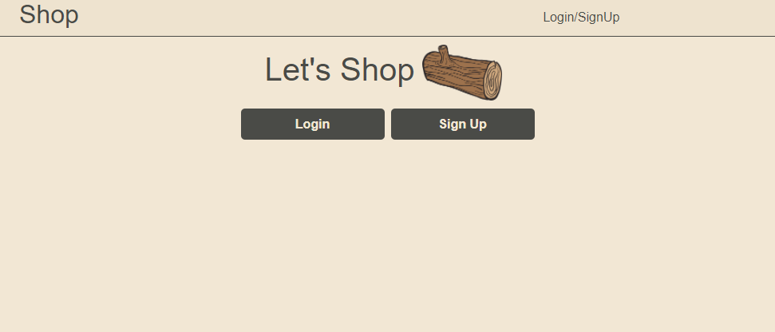

# **Shop**

## **Description**
Shop is a platform for creative and entrepreneurial people to come together and share their personal products.  Shop allows for posts with descriptions, prices and images and allows for cross-user interaction through comments and votes!

## **Table of Contents**

- [Installation](#installation)
- [Usage](#usage)
- [Screenshots](#screenshots)
- [Contributing](#contributing)
- [Testing](#testing)
- [Questions](#questions)

## **Installation**

To use our website, simply head over to [Shop](heroku) and create an account to begin posting!  If you would like to install shop locally, you can clone the code from the GitHub repository at [Shop](https://github.com/MeghanPaul/Group1Project).  After cloning the code you will need to install the required packages from the package.json file.

## **Usage**

Shop is designed to host user's products to share and grow their brand.  After creating an account users can go to their profile page from the navigation menu to post their products for other users to see.

You can add a title, description, price and image for your products.  You can also edit and delete your posted products from the profile page.  To comment on a post simply click on the button on the homepage which will take you to that product.

## **Screenshots**

## **Contributing**

If you wish to contribute to this project, reach out to any of the collaborators in the GitHub repository with what you would like to add to the website.  If they approve you can fork the repository and request to pull your changes to the main code!

## **Testing**

You can test out the different links and product functionality by inputting faulty information when creating a new product.  If you find any errors or improper error handling please reach out to the collaborators in the GitHub repo!

## **Questions**

Reach out to the collaborators on this project if you have any questions!  They can be found [here](https://github.com/MeghanPaul/Group1Project/graphs/contributors).